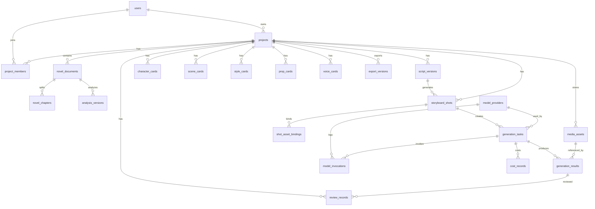

# AI 内容工业化平台｜数据库 ERD 设计

> 适用范围：第一阶段核心闭环原型。  
> 推荐数据库：PostgreSQL。  
> 推荐扩展：pgvector、uuid-ossp 或使用应用层 UUID、JSONB。  
> 设计原则：项目隔离、版本化、审核可追溯、媒体文件元数据入库、模型调用可统计。

---

## 1. 数据库设计目标

第一阶段数据库需要支撑以下核心链路：

1. 项目创建与生产状态管理。
2. 小说文本、章节、片段管理。
3. AI 小说分析结果版本管理。
4. 剧本版本管理。
5. 角色卡、场景卡、风格卡、道具卡、声音卡管理。
6. Storyboard 镜头卡管理。
7. 镜头级图像、视频、语音生成任务管理。
8. 多版本生成结果审核。
9. 媒体资产、提示词、模型参数、成本和失败案例沉淀。

---

## 2. 核心实体分层

```text
组织与用户层
├─ users
└─ project_members

项目生产层
├─ projects
├─ novel_documents
├─ novel_chapters
├─ analysis_versions
└─ script_versions

资产层
├─ character_cards
├─ scene_cards
├─ style_cards
├─ prop_cards
├─ voice_cards
└─ media_assets

镜头与生成层
├─ storyboard_shots
├─ shot_asset_bindings
├─ generation_tasks
├─ generation_results
└─ review_records

模型与运营层
├─ model_providers
├─ model_invocations
├─ prompt_templates
├─ cost_records
└─ export_versions
```

---

## 3. ERD 总览 Mermaid



---

## 4. 枚举设计

### 4.1 project_status
| 值 | 说明 |
|---|---|
| draft | 草稿 |
| novel_uploaded | 小说已输入 |
| analysis_running | 小说分析中 |
| analysis_review | 小说分析待确认 |
| script_running | 剧本生成中 |
| script_review | 剧本待确认 |
| asset_running | 资产生成中 |
| asset_review | 资产待确认 |
| storyboard_running | Storyboard 生成中 |
| storyboard_review | Storyboard 待确认 |
| generation_running | 镜头生成中 |
| generation_review | 生成结果待审核 |
| post_processing | 后期预览中 |
| completed | 已完成 |
| archived | 已归档 |

### 4.2 version_status
| 值 | 说明 |
|---|---|
| candidate | 候选版本 |
| confirmed | 正式版本 |
| history | 历史版本 |
| rejected | 已退回 |
| discarded | 已废弃 |

### 4.3 review_status
| 值 | 说明 |
|---|---|
| pending | 待审核 |
| approved | 已通过 |
| rejected | 已退回 |
| need_changes | 需修改 |
| discarded | 已废弃 |

### 4.4 task_status
| 值 | 说明 |
|---|---|
| pending | 待执行 |
| queued | 排队中 |
| running | 执行中 |
| succeeded | 成功 |
| failed | 失败 |
| canceled | 已取消 |

### 4.5 generation_task_type
| 值 | 说明 |
|---|---|
| novel_analysis | 小说分析 |
| script_generation | 剧本生成 |
| asset_card_generation | 资产卡生成 |
| storyboard_generation | Storyboard 生成 |
| image_generation | 图像生成 |
| video_generation | 视频生成 |
| tts_generation | 语音生成 |
| subtitle_generation | 字幕生成 |
| preview_export | 预览导出 |

### 4.6 media_asset_type
| 值 | 说明 |
|---|---|
| source_text | 原文文件 |
| reference_image | 参考图 |
| generated_image | 生成图 |
| generated_video | 生成视频 |
| audio | 音频 |
| subtitle | 字幕 |
| export_video | 导出视频 |
| document | 文档 |

---

## 5. 表结构设计

### 5.1 users
| 字段 | 类型 | 约束 | 说明 |
|---|---|---|---|
| id | uuid | PK | 用户 ID |
| name | varchar(100) | not null | 用户名称 |
| email | varchar(255) | unique | 邮箱 |
| avatar_url | text |  | 头像 |
| role | varchar(50) | not null default 'member' | 全局角色 |
| created_at | timestamptz | not null | 创建时间 |
| updated_at | timestamptz | not null | 更新时间 |

### 5.2 projects
| 字段 | 类型 | 约束 | 说明 |
|---|---|---|---|
| id | uuid | PK | 项目 ID |
| name | varchar(200) | not null | 项目名称 |
| project_type | varchar(50) | not null | 短剧/漫剧/动漫/影视 |
| genre | varchar(100) |  | 题材 |
| target_duration_seconds | int |  | 目标时长 |
| target_episode_count | int |  | 目标集数 |
| aspect_ratio | varchar(20) | not null default '16:9' | 画幅 |
| language | varchar(50) | not null default 'zh-CN' | 语言 |
| style_direction | text |  | 初始风格方向 |
| status | varchar(50) | not null | 项目状态 |
| owner_id | uuid | FK users.id | 创建人 |
| current_analysis_version_id | uuid | nullable | 当前正式分析版本 |
| current_script_version_id | uuid | nullable | 当前正式剧本版本 |
| metadata | jsonb | default '{}' | 扩展信息 |
| created_at | timestamptz | not null | 创建时间 |
| updated_at | timestamptz | not null | 更新时间 |

### 5.3 project_members
| 字段 | 类型 | 约束 | 说明 |
|---|---|---|---|
| id | uuid | PK | 记录 ID |
| project_id | uuid | FK projects.id | 项目 |
| user_id | uuid | FK users.id | 用户 |
| role | varchar(50) | not null | owner/editor/reviewer/viewer |
| created_at | timestamptz | not null | 加入时间 |

唯一约束：`unique(project_id, user_id)`。

### 5.4 novel_documents
| 字段 | 类型 | 约束 | 说明 |
|---|---|---|---|
| id | uuid | PK | 小说文档 ID |
| project_id | uuid | FK projects.id | 项目 |
| title | varchar(200) | not null | 文档标题 |
| source_type | varchar(50) | not null | paste/upload/import |
| raw_text | text |  | 原始文本 |
| media_asset_id | uuid | FK media_assets.id nullable | 上传文件 |
| word_count | int | default 0 | 字数 |
| status | varchar(50) | not null default 'draft' | 状态 |
| created_by | uuid | FK users.id | 创建人 |
| created_at | timestamptz | not null | 创建时间 |
| updated_at | timestamptz | not null | 更新时间 |

### 5.5 novel_chapters
| 字段 | 类型 | 约束 | 说明 |
|---|---|---|---|
| id | uuid | PK | 章节 ID |
| document_id | uuid | FK novel_documents.id | 文档 |
| project_id | uuid | FK projects.id | 项目冗余字段，便于查询 |
| chapter_no | int | not null | 章节序号 |
| title | varchar(200) |  | 章节标题 |
| content | text | not null | 章节正文 |
| word_count | int | default 0 | 字数 |
| summary | text |  | 章节摘要 |
| created_at | timestamptz | not null | 创建时间 |
| updated_at | timestamptz | not null | 更新时间 |

### 5.6 analysis_versions
| 字段 | 类型 | 约束 | 说明 |
|---|---|---|---|
| id | uuid | PK | 分析版本 ID |
| project_id | uuid | FK projects.id | 项目 |
| novel_document_id | uuid | FK novel_documents.id | 来源文本 |
| version_no | int | not null | 版本号 |
| status | varchar(50) | not null | candidate/confirmed/history |
| review_status | varchar(50) | not null default 'pending' | 审核状态 |
| theme | text |  | 故事主题 |
| summary | text |  | 故事梗概 |
| plot_structure | jsonb | default '{}' | 剧情结构 |
| characters | jsonb | default '[]' | 人物关系 |
| scenes | jsonb | default '[]' | 场景列表 |
| props | jsonb | default '[]' | 道具列表 |
| conflicts | jsonb | default '[]' | 冲突列表 |
| emotion_curve | jsonb | default '[]' | 情绪曲线 |
| prompt_snapshot | text |  | 生成提示词快照 |
| model_invocation_id | uuid | nullable | 模型调用记录 |
| created_by | uuid | FK users.id | 创建人 |
| confirmed_by | uuid | FK users.id nullable | 确认人 |
| confirmed_at | timestamptz | nullable | 确认时间 |
| created_at | timestamptz | not null | 创建时间 |
| updated_at | timestamptz | not null | 更新时间 |

### 5.7 script_versions
| 字段 | 类型 | 约束 | 说明 |
|---|---|---|---|
| id | uuid | PK | 剧本版本 ID |
| project_id | uuid | FK projects.id | 项目 |
| analysis_version_id | uuid | FK analysis_versions.id | 来源分析版本 |
| version_no | int | not null | 版本号 |
| status | varchar(50) | not null | 版本状态 |
| review_status | varchar(50) | not null default 'pending' | 审核状态 |
| title | varchar(200) |  | 剧本标题 |
| logline | text |  | 一句话故事 |
| episodes | jsonb | default '[]' | 分集结构 |
| scenes | jsonb | default '[]' | 分场剧本 |
| full_text | text |  | 可读剧本文本 |
| prompt_snapshot | text |  | 提示词快照 |
| model_invocation_id | uuid | nullable | 模型调用记录 |
| created_by | uuid | FK users.id | 创建人 |
| confirmed_by | uuid | FK users.id nullable | 确认人 |
| confirmed_at | timestamptz | nullable | 确认时间 |
| created_at | timestamptz | not null | 创建时间 |
| updated_at | timestamptz | not null | 更新时间 |

---

## 6. 资产卡表

### 6.1 character_cards
| 字段 | 类型 | 说明 |
|---|---|---|
| id | uuid PK | 角色卡 ID |
| project_id | uuid FK | 项目 |
| name | varchar(100) | 姓名 |
| aliases | jsonb | 别名 |
| age | varchar(50) | 年龄 |
| gender | varchar(50) | 性别 |
| identity | varchar(200) | 身份/职业 |
| relationships | jsonb | 人物关系 |
| personality_keywords | jsonb | 性格关键词 |
| motivation | text | 人物动机 |
| appearance | jsonb | 外形设定 |
| hair_face_body | jsonb | 发型五官体型 |
| signature_features | jsonb | 标志性特征 |
| costume_system | jsonb | 服装系统 |
| expression_library | jsonb | 表情库 |
| action_habits | jsonb | 动作习惯 |
| voice_style | jsonb | 声音风格 |
| positive_prompt | text | 正向提示词 |
| negative_prompt | text | 负向提示词 |
| reference_asset_ids | uuid[] | 参考图 |
| version_no | int | 版本号 |
| status | varchar(50) | 版本状态 |
| review_status | varchar(50) | 审核状态 |
| created_at / updated_at | timestamptz | 时间 |

### 6.2 scene_cards
| 字段 | 类型 | 说明 |
|---|---|---|
| id | uuid PK | 场景卡 ID |
| project_id | uuid FK | 项目 |
| name | varchar(200) | 场景名称 |
| space_type | varchar(100) | 空间类型 |
| era_background | text | 时代背景 |
| layout_description | text | 空间布局 |
| door_window_positions | jsonb | 门窗位置 |
| key_props | jsonb | 关键道具 |
| architectural_style | text | 建筑风格 |
| lighting | text | 光线设定 |
| weather | varchar(100) | 天气 |
| color_palette | jsonb | 色彩基调 |
| camera_angles | jsonb | 常用镜头角度 |
| immutable_elements | jsonb | 不可变空间元素 |
| positive_prompt | text | 正向提示词 |
| negative_prompt | text | 负向提示词 |
| reference_asset_ids | uuid[] | 参考图 |
| version_no/status/review_status | mixed | 版本与审核 |

### 6.3 style_cards
| 字段 | 类型 | 说明 |
|---|---|---|
| id | uuid PK | 风格卡 ID |
| project_id | uuid FK | 项目 |
| name | varchar(200) | 风格名称 |
| work_type | varchar(100) | 作品类型 |
| art_style | text | 美术风格 |
| color_tone | text | 色彩基调 |
| lighting_rule | text | 光影规则 |
| lens_texture | text | 镜头质感 |
| material_style | text | 材质风格 |
| composition_preference | text | 构图偏好 |
| positive_prompt | text | 正向提示词 |
| negative_prompt | text | 负向提示词 |
| reference_asset_ids | uuid[] | 风格参考图 |
| version_no/status/review_status | mixed | 版本与审核 |

### 6.4 prop_cards
| 字段 | 类型 | 说明 |
|---|---|---|
| id | uuid PK | 道具卡 ID |
| project_id | uuid FK | 项目 |
| name | varchar(200) | 道具名称 |
| narrative_function | text | 剧情作用 |
| appearance | text | 外观设定 |
| material | varchar(100) | 材质 |
| size | varchar(100) | 尺寸 |
| color | varchar(100) | 颜色 |
| wear_level | varchar(100) | 磨损程度 |
| holder_character_id | uuid | 持有角色 |
| appeared_scene_refs | jsonb | 出现场次 |
| immutable_features | jsonb | 不可变特征 |
| positive_prompt/negative_prompt | text | 提示词 |
| reference_asset_ids | uuid[] | 参考图 |

### 6.5 voice_cards
| 字段 | 类型 | 说明 |
|---|---|---|
| id | uuid PK | 声音卡 ID |
| project_id | uuid FK | 项目 |
| name | varchar(200) | 声音卡名称 |
| character_id | uuid nullable | 关联角色 |
| voice_line | text | 角色声线 |
| age_feel | varchar(100) | 年龄感 |
| speed | varchar(100) | 语速 |
| tone | varchar(100) | 语气 |
| accent | varchar(100) | 口音 |
| emotion_style | text | 情绪表达 |
| dialogue_style | text | 台词风格 |
| voice_provider | varchar(100) | TTS 供应商 |
| voice_id | varchar(200) | 固定 Voice ID |
| sample_asset_ids | uuid[] | 声音样本 |
| environment_sound | text | 环境声 |
| music_mood | text | 音乐情绪 |

---

## 7. 镜头与生成表

### 7.1 storyboard_shots
| 字段 | 类型 | 说明 |
|---|---|---|
| id | uuid PK | 镜头 ID |
| project_id | uuid FK | 项目 |
| script_version_id | uuid FK | 来源剧本版本 |
| shot_no | varchar(50) | 镜头编号 |
| episode_no | int | 集数 |
| scene_no | int | 场次 |
| paragraph_ref | varchar(100) | 所属段落 |
| title | varchar(200) | 镜头标题 |
| description | text | 画面描述 |
| keyframe_asset_id | uuid nullable | 关键帧 |
| shot_size | varchar(50) | 景别 |
| camera_angle | varchar(50) | 机位 |
| camera_movement | varchar(100) | 运镜 |
| character_ids | uuid[] | 绑定角色 |
| scene_card_id | uuid nullable | 绑定场景 |
| style_card_id | uuid nullable | 绑定风格 |
| prop_card_ids | uuid[] | 绑定道具 |
| voice_card_ids | uuid[] | 绑定声音 |
| action_description | text | 角色动作 |
| emotion_description | text | 情绪表情 |
| dialogue | text | 台词 |
| narration | text | 旁白 |
| sound_effects | text | 音效 |
| music | text | 配乐 |
| duration_seconds | numeric(6,2) | 镜头时长 |
| positive_prompt | text | 正向提示词 |
| negative_prompt | text | 负向提示词 |
| generation_status | varchar(50) | 生成状态 |
| review_status | varchar(50) | 审核状态 |
| sort_order | int | 排序 |
| created_at / updated_at | timestamptz | 时间 |

### 7.2 shot_asset_bindings
用于细化镜头与资产的多态绑定关系，便于查询某个资产被哪些镜头使用。

| 字段 | 类型 | 说明 |
|---|---|---|
| id | uuid PK | 绑定 ID |
| project_id | uuid FK | 项目 |
| shot_id | uuid FK | 镜头 |
| asset_type | varchar(50) | character/scene/style/prop/voice/media |
| asset_id | uuid | 对应资产 ID |
| binding_role | varchar(100) | main/support/reference |
| created_at | timestamptz | 创建时间 |

### 7.3 generation_tasks
| 字段 | 类型 | 说明 |
|---|---|---|
| id | uuid PK | 任务 ID |
| project_id | uuid FK | 项目 |
| shot_id | uuid nullable | 镜头 |
| task_type | varchar(50) | 任务类型 |
| input_mode | varchar(50) | text_to_video/image_to_video 等 |
| model_provider_id | uuid FK | 模型供应商 |
| model_name | varchar(200) | 模型名称 |
| prompt | text | 正向提示词 |
| negative_prompt | text | 负向提示词 |
| input_asset_ids | uuid[] | 输入素材 |
| parameters | jsonb | 模型参数 |
| status | varchar(50) | 任务状态 |
| priority | int | 优先级 |
| retry_count | int | 重试次数 |
| cost_estimate | numeric(12,4) | 预估成本 |
| started_at | timestamptz | 开始时间 |
| finished_at | timestamptz | 结束时间 |
| error_code | varchar(100) | 错误码 |
| error_message | text | 错误信息 |
| created_by | uuid | 创建人 |
| created_at / updated_at | timestamptz | 时间 |

### 7.4 generation_results
| 字段 | 类型 | 说明 |
|---|---|---|
| id | uuid PK | 生成结果 ID |
| task_id | uuid FK | 生成任务 |
| project_id | uuid FK | 项目 |
| shot_id | uuid nullable | 镜头 |
| result_no | int | 结果序号 |
| media_asset_id | uuid FK | 媒体文件 |
| thumbnail_asset_id | uuid nullable | 缩略图 |
| prompt_snapshot | text | 提示词快照 |
| parameters_snapshot | jsonb | 参数快照 |
| model_name | varchar(200) | 模型 |
| status | varchar(50) | 成功/失败 |
| review_status | varchar(50) | 审核状态 |
| is_confirmed | boolean | 是否通过版本 |
| score | numeric(5,2) | 人工或系统评分 |
| failure_reason | text | 失败原因 |
| created_at | timestamptz | 创建时间 |

### 7.5 review_records
| 字段 | 类型 | 说明 |
|---|---|---|
| id | uuid PK | 审核记录 ID |
| project_id | uuid FK | 项目 |
| target_type | varchar(50) | analysis/script/card/shot/result/export |
| target_id | uuid | 被审核对象 |
| from_status | varchar(50) | 原状态 |
| to_status | varchar(50) | 新状态 |
| comment | text | 审核意见 |
| reviewer_id | uuid FK | 审核人 |
| created_at | timestamptz | 审核时间 |

---

## 8. 媒体、模型与成本表

### 8.1 media_assets
| 字段 | 类型 | 说明 |
|---|---|---|
| id | uuid PK | 文件资产 ID |
| project_id | uuid FK | 项目 |
| asset_type | varchar(50) | 文件类型 |
| file_name | varchar(255) | 文件名 |
| storage_provider | varchar(50) | minio/oss/cos/s3 |
| storage_key | text | 存储路径 |
| public_url | text nullable | 公共 URL，不建议默认开放 |
| mime_type | varchar(100) | MIME |
| size_bytes | bigint | 文件大小 |
| duration_seconds | numeric(10,2) | 音视频时长 |
| width | int | 宽 |
| height | int | 高 |
| hash | varchar(128) | 文件哈希 |
| source_type | varchar(50) | upload/generated/export |
| metadata | jsonb | 扩展信息 |
| created_by | uuid | 创建人 |
| created_at | timestamptz | 创建时间 |

### 8.2 model_providers
| 字段 | 类型 | 说明 |
|---|---|---|
| id | uuid PK | 模型配置 ID |
| provider | varchar(100) | 供应商 |
| model_name | varchar(200) | 模型名称 |
| model_type | varchar(50) | text/image/video/audio/subtitle |
| capabilities | jsonb | 能力标签 |
| default_parameters | jsonb | 默认参数 |
| cost_config | jsonb | 成本配置 |
| is_enabled | boolean | 是否启用 |
| secret_ref | varchar(200) | 密钥引用，不存明文 |
| created_at / updated_at | timestamptz | 时间 |

### 8.3 model_invocations
| 字段 | 类型 | 说明 |
|---|---|---|
| id | uuid PK | 调用记录 ID |
| provider_id | uuid FK | 模型配置 |
| task_id | uuid nullable | 关联任务 |
| project_id | uuid nullable | 项目 |
| request_summary | jsonb | 请求摘要 |
| response_summary | jsonb | 响应摘要 |
| prompt_tokens | int | 输入 token |
| completion_tokens | int | 输出 token |
| media_units | numeric | 图片/秒数等计费单位 |
| status | varchar(50) | 成功/失败 |
| latency_ms | int | 耗时 |
| error_message | text | 错误 |
| created_at | timestamptz | 调用时间 |

### 8.4 cost_records
| 字段 | 类型 | 说明 |
|---|---|---|
| id | uuid PK | 成本记录 ID |
| project_id | uuid FK | 项目 |
| task_id | uuid nullable | 任务 |
| invocation_id | uuid nullable | 模型调用 |
| provider | varchar(100) | 供应商 |
| model_name | varchar(200) | 模型 |
| cost_type | varchar(50) | token/image/second/export |
| quantity | numeric(12,4) | 数量 |
| unit_price | numeric(12,6) | 单价 |
| amount | numeric(12,4) | 金额 |
| currency | varchar(20) | 币种 |
| created_at | timestamptz | 记录时间 |

### 8.5 prompt_templates
| 字段 | 类型 | 说明 |
|---|---|---|
| id | uuid PK | 模板 ID |
| name | varchar(200) | 模板名称 |
| template_type | varchar(50) | novel_analysis/script/card/storyboard/image/video |
| project_type | varchar(50) | 适用项目类型 |
| content | text | 模板内容 |
| variables | jsonb | 变量定义 |
| version_no | int | 版本号 |
| is_enabled | boolean | 是否启用 |
| created_by | uuid | 创建人 |
| created_at / updated_at | timestamptz | 时间 |

### 8.6 export_versions
| 字段 | 类型 | 说明 |
|---|---|---|
| id | uuid PK | 导出版本 ID |
| project_id | uuid FK | 项目 |
| version_no | int | 版本号 |
| title | varchar(200) | 标题 |
| media_asset_id | uuid FK | 导出视频 |
| shot_ids | uuid[] | 包含镜头 |
| export_settings | jsonb | 导出设置 |
| status | varchar(50) | exporting/succeeded/failed |
| review_status | varchar(50) | 审核状态 |
| created_by | uuid | 创建人 |
| created_at | timestamptz | 创建时间 |

---

## 9. 关键索引建议

| 表 | 索引 |
|---|---|
| projects | `(owner_id, status)`、`(updated_at desc)` |
| project_members | `unique(project_id, user_id)` |
| novel_chapters | `(document_id, chapter_no)` |
| analysis_versions | `unique(project_id, version_no)`、`(project_id, status)` |
| script_versions | `unique(project_id, version_no)`、`(project_id, status)` |
| character_cards | `(project_id, name)`、`(project_id, review_status)` |
| scene_cards | `(project_id, name)` |
| storyboard_shots | `(project_id, sort_order)`、`(project_id, episode_no, scene_no)`、`(review_status)` |
| shot_asset_bindings | `(asset_type, asset_id)`、`(shot_id)` |
| generation_tasks | `(project_id, status)`、`(shot_id, task_type)`、`(created_at desc)` |
| generation_results | `(task_id)`、`(shot_id, is_confirmed)` |
| review_records | `(target_type, target_id)`、`(project_id, created_at desc)` |
| media_assets | `(project_id, asset_type)`、`(hash)` |
| model_invocations | `(project_id, created_at desc)`、`(provider_id, status)` |
| cost_records | `(project_id, created_at desc)`、`(task_id)` |

---

## 10. 设计约束与建议

1. 所有核心业务表必须带 `project_id`，便于项目隔离与查询。
2. AI 生成类数据必须保留 `prompt_snapshot` 和 `parameters_snapshot`。
3. 正式版本通过 `status=confirmed` 标识，同类对象同一项目原则上只能有一个正式版本。
4. 媒体文件只在数据库保存元数据，文件本体存对象存储。
5. 模型密钥不进入数据库明文字段，只保存密钥引用 `secret_ref`。
6. JSONB 用于第一阶段快速迭代；稳定后可将高频查询字段拆成独立表。
7. 生成结果永远不自动覆盖正式结果，必须经过审核确认。
8. 审核记录不可物理删除，只可追加。
