# AI 内容工业化平台｜C4 模型、流程图、架构图与关键时序图

> 适用范围：第一阶段核心闭环原型与后续平台化建设。  
> 图表格式：Mermaid / C4 Mermaid。  
> 使用方式：可直接复制到支持 Mermaid 的 Markdown、Notion、语雀、GitHub、Mermaid Live Editor、部分架构文档工具中渲染。  

---

## 1. 图表总览

本文档包含以下图表：

1. C4 Level 1：系统上下文图。
2. C4 Level 2：容器图。
3. C4 Level 3：后端服务组件图。
4. C4 Level 3：模型适配层组件图。
5. C4 Level 3：前端页面模块图。
6. 端到端业务流程图。
7. 第一阶段 MVP 流程图。
8. 技术架构图。
9. 部署架构图。
10. 数据流图。
11. 状态流转图。
12. 关键节点时序图：创建项目与小说输入。
13. 关键节点时序图：AI 小说分析。
14. 关键节点时序图：剧本化改写。
15. 关键节点时序图：资产卡生成。
16. 关键节点时序图：AI Storyboard 生成。
17. 关键节点时序图：关键帧/参考图生成。
18. 关键节点时序图：镜头级视频生成。
19. 关键节点时序图：人工审核与版本确认。
20. 关键节点时序图：后期预览与导出。

---

## 2. C4 Level 1：系统上下文图

### 2.1 说明

该图用于向老板、产品、技术团队说明平台与外部用户、外部模型、对象存储、通知系统等之间的关系。

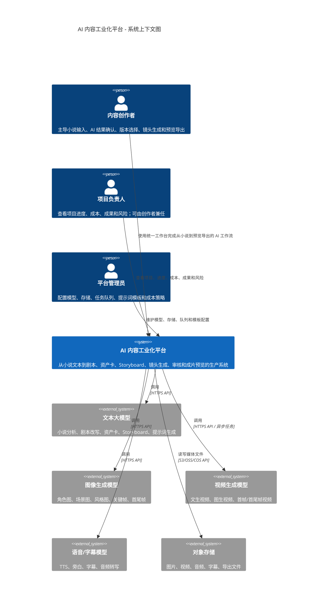

---

## 3. C4 Level 2：容器图

### 3.1 说明

该图用于说明平台内部主要容器：Web 前端、API 服务、Worker、模型适配层、数据库、对象存储、队列等。

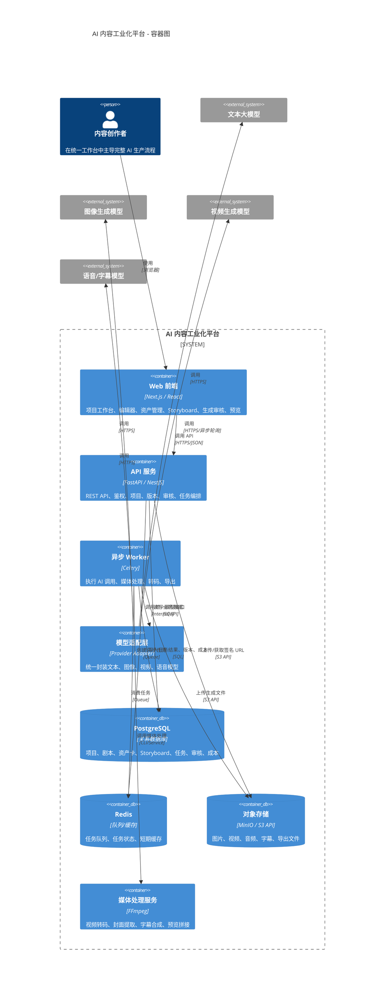

---

## 4. C4 Level 3：后端服务组件图

### 4.1 说明

该图描述 API 服务内部组件边界，便于后端团队拆分模块。

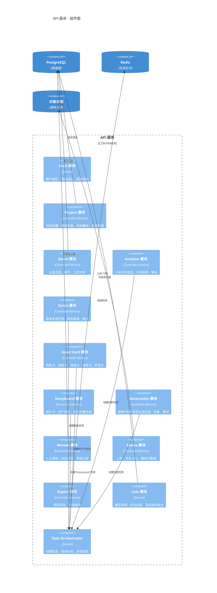

---

## 5. C4 Level 3：模型适配层组件图

### 5.1 说明

模型适配层用于屏蔽不同模型供应商差异，保证业务层不直接依赖某个模型 API。

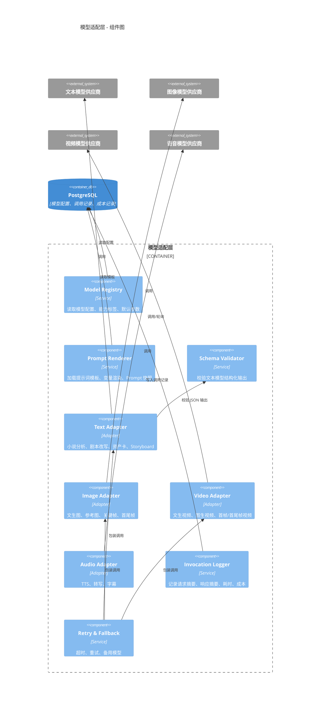

---

## 6. C4 Level 3：前端页面模块图

### 6.1 说明

该图用于前端团队拆分页面、组件和状态管理。

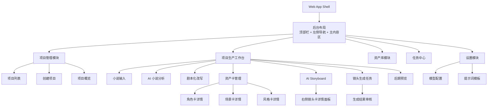

---

## 7. 端到端业务流程图

### 7.1 说明

该图展示从小说输入到成片预览的完整业务链路。

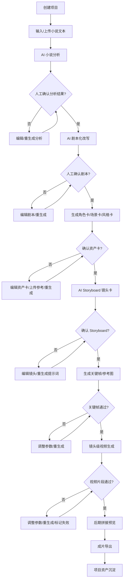

---

## 8. 第一阶段 MVP 流程图

### 8.1 说明

该图用于研发排期和老板汇报，突出第一阶段最小闭环。

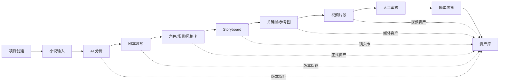

---

## 9. 技术架构图

### 9.1 说明

该图展示第一阶段推荐技术架构。

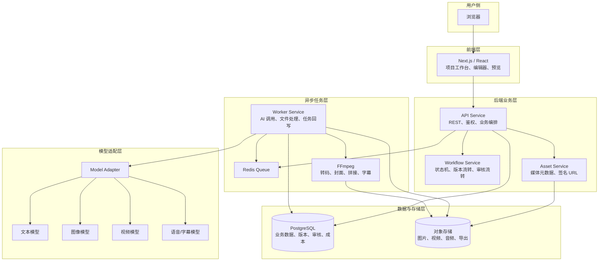

---

## 10. 部署架构图

### 10.1 说明

第一阶段可采用 Docker Compose 部署，后续可平滑迁移到 Kubernetes。

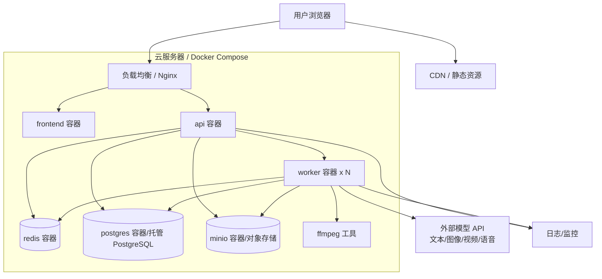

---

## 11. 数据流图

### 11.1 说明

该图展示文本、结构化数据、媒体文件和审核记录在系统中的流转。

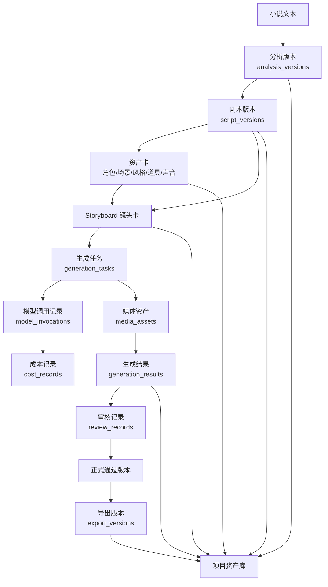

---

## 12. 核心状态流转图

### 12.1 项目状态流转

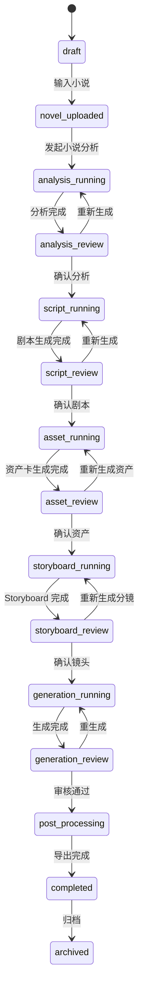

### 12.2 生成任务状态流转

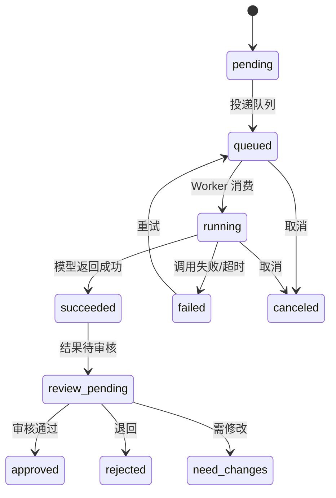

---

## 13. 时序图：创建项目与小说输入

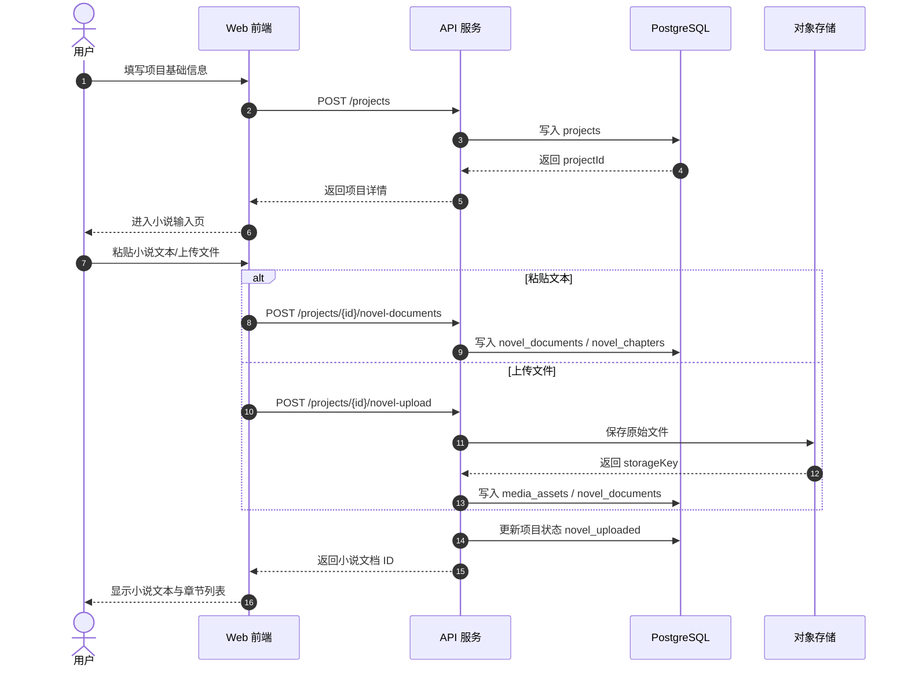

---

## 14. 时序图：AI 小说分析

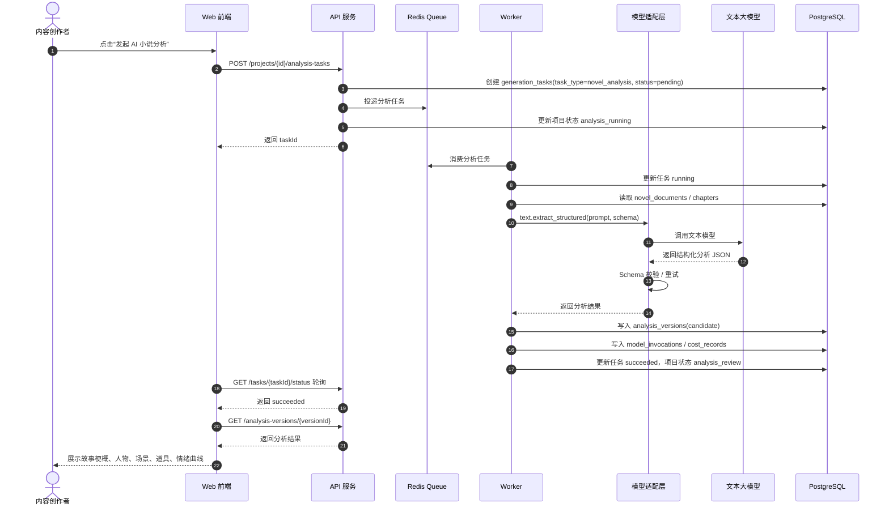

---

## 15. 时序图：剧本化改写

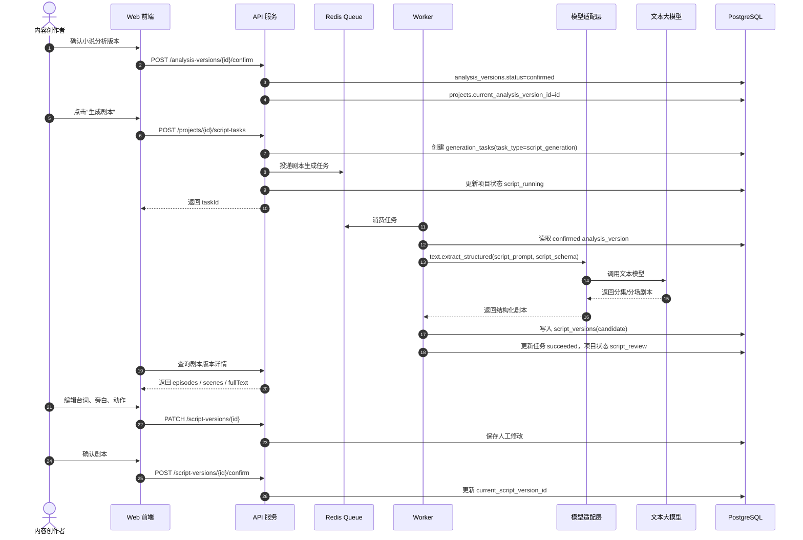

---

## 16. 时序图：资产卡生成

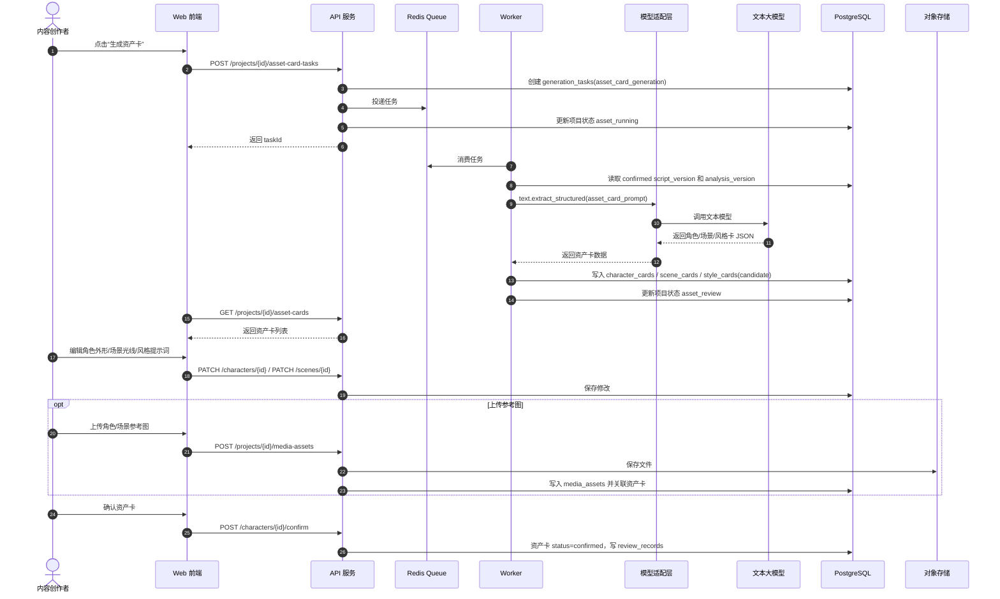

---

## 17. 时序图：AI Storyboard 生成

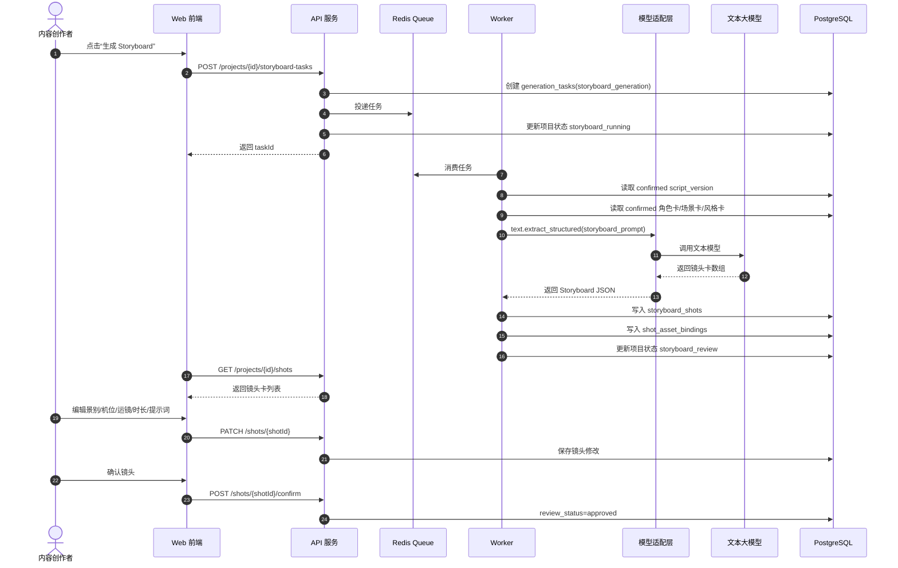

---

## 18. 时序图：关键帧 / 参考图生成

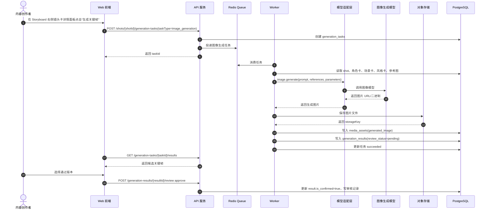

---

## 19. 时序图：镜头级视频生成

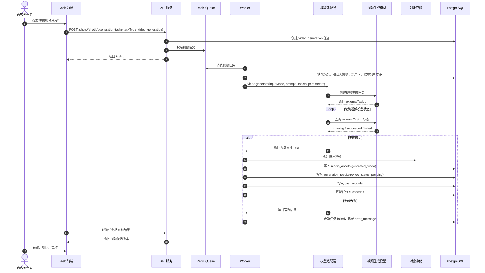

---

## 20. 时序图：人工审核与版本确认

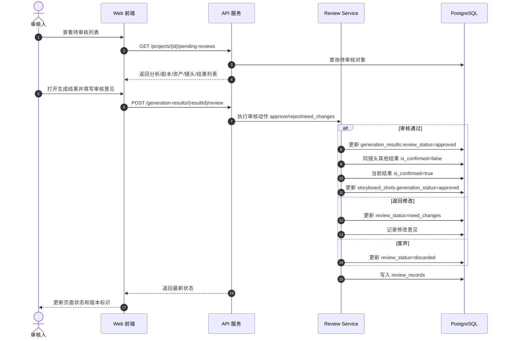

---

## 21. 时序图：后期预览与导出

```mermaid
sequenceDiagram
    autonumber
    actor User as 内容创作者
    participant Web as Web 前端
    participant API as API 服务
    participant Queue as Redis Queue
    participant Worker as Worker
    participant FFmpeg as FFmpeg
    participant Storage as 对象存储
    participant DB as PostgreSQL

    User->>Web: 点击“生成预览”
    Web->>API: POST /projects/{id}/preview-tasks
    API->>DB: 校验所有镜头存在通过版本
    API->>DB: 创建 generation_tasks(preview_export)
    API->>Queue: 投递导出任务
    API-->>Web: 返回 taskId

    Worker->>Queue: 消费导出任务
    Worker->>DB: 查询通过镜头和视频 media_assets
    Worker->>Storage: 获取视频文件/签名 URL
    Worker->>FFmpeg: 按 sort_order 拼接视频、合成字幕/音频
    FFmpeg-->>Worker: 输出预览视频文件
    Worker->>Storage: 上传导出视频
    Storage-->>Worker: 返回 storageKey
    Worker->>DB: 写入 media_assets(export_video)
    Worker->>DB: 写入 export_versions
    Worker->>DB: 更新任务 succeeded

    Web->>API: GET /tasks/{taskId}/status
    API-->>Web: 返回 succeeded
    Web->>API: GET /projects/{id}/exports
    API-->>Web: 返回导出版本
    Web-->>User: 展示成片预览播放器和下载入口
```

---

## 22. 图表使用建议

### 22.1 给老板汇报

建议使用以下图：

1. C4 Level 1 系统上下文图。
2. 端到端业务流程图。
3. 第一阶段 MVP 流程图。
4. 技术架构图。
5. 项目状态流转图。

### 22.2 给产品和设计

建议使用以下图：

1. 端到端业务流程图。
2. 第一阶段 MVP 流程图。
3. 前端页面模块图。
4. 人工审核与版本确认时序图。
5. 项目状态流转图。

### 22.3 给技术团队

建议使用以下图：

1. C4 Level 2 容器图。
2. C4 Level 3 后端组件图。
3. C4 Level 3 模型适配层组件图。
4. 技术架构图。
5. 部署架构图。
6. 数据流图。
7. 所有关键时序图。

---

## 23. 后续可补充图表

后续进入详细研发阶段后，建议继续补充：

1. 数据库物理 ERD 图。
2. 任务队列 Topic / Queue 拆分图。
3. 模型供应商能力矩阵图。
4. 权限模型图。
5. 文件生命周期图。
6. 成本统计数据流图。
7. 异常重试与降级流程图。
8. 创作者与 AI 节点协作泳道图。
