# AI 内容工业化平台建设方案

## 一、项目摘要

建议启动建设一套面向影视动漫、短剧、漫剧内容生产的 AI 内容工业化平台。

平台以小说、故事梗概、剧本文本等内容为输入，通过 AI 完成内容理解、项目画像提取、剧本化改写、角色/场景/风格资产生成、AI Storyboard、镜头级图像与视频生成、人工审核、后期预览与导出，最终形成一条可管理、可复用、可追溯的内容生产流水线。

这个项目不是简单接入几个 AI 工具，也不是让 AI 一句话直接生成整部视频，而是把公司影视动漫内容生产经验沉淀为标准流程、结构化资产和可控工作台，让 AI 在确定的生产链路中提高效率、降低试错成本，并逐步形成公司自己的 AI 内容生产能力。

第一阶段建议先做核心闭环原型，用 8-12 周验证“一个创作者 + AI 工作流”能否完成从小说到视频片段/粗剪预览的完整流程。

---

## 二、为什么现在要做

AI 已经开始重塑内容生产。文本大模型可以理解小说、拆解剧情、改写剧本；图像模型可以生成角色、场景、分镜和关键帧；视频模型可以生成镜头片段；语音模型可以生成旁白和角色配音。

但目前多数 AI 内容生产仍停留在单点工具阶段，常见问题是：

1. 每个项目临时写提示词，经验难沉淀。
2. 小说、剧本、角色、分镜、视频生成之间割裂。
3. 角色形象、场景空间、视觉风格在多镜头中不稳定。
4. 生成结果不可控，不知道该改文本、提示词、参考图还是模型参数。
5. 视频片段生成后难以追溯来源，也难以复用成功经验。
6. 成本、失败原因、模型效果缺少统一记录。

如果直接用一句提示词生成视频，短期可以做演示，但很难支撑连续叙事、多镜头一致性、可修改和规模化生产。

真正适合公司落地的方向，是在视频生成之前先建立结构化中间层：把小说拆解成剧本、角色卡、场景卡、风格卡、Storyboard 和镜头提示词，再以镜头为单位调用图像、视频和语音模型。这样 AI 生成才有约束、有版本、有审核、有资产沉淀。

---

## 三、项目定位

项目定位为：

面向影视动漫、短剧、漫剧内容生产的 AI 内容工业化平台。

平台核心链路为：

```text
创建项目
  -> 输入小说 / 故事文本
  -> 确认源内容版本
  -> AI 提取项目画像
  -> AI 小说分析
  -> 剧本化改写
  -> 生成角色 / 场景 / 风格资产卡
  -> 生成 AI Storyboard
  -> 镜头级图像 / 视频 / 语音生成
  -> 人工审核与版本确认
  -> 后期预览与导出
  -> 项目资产沉淀
```

### 管理层图示速览

下面四类图用于快速说明平台不是单点 AI 工具，而是一套“内容结构化、资产沉淀、镜头生成、人工确认”的生产系统。其中第一张保留老板速览视角，第二张用于补全平台能力边界。

#### 1. 老板速览版平台能力架构图

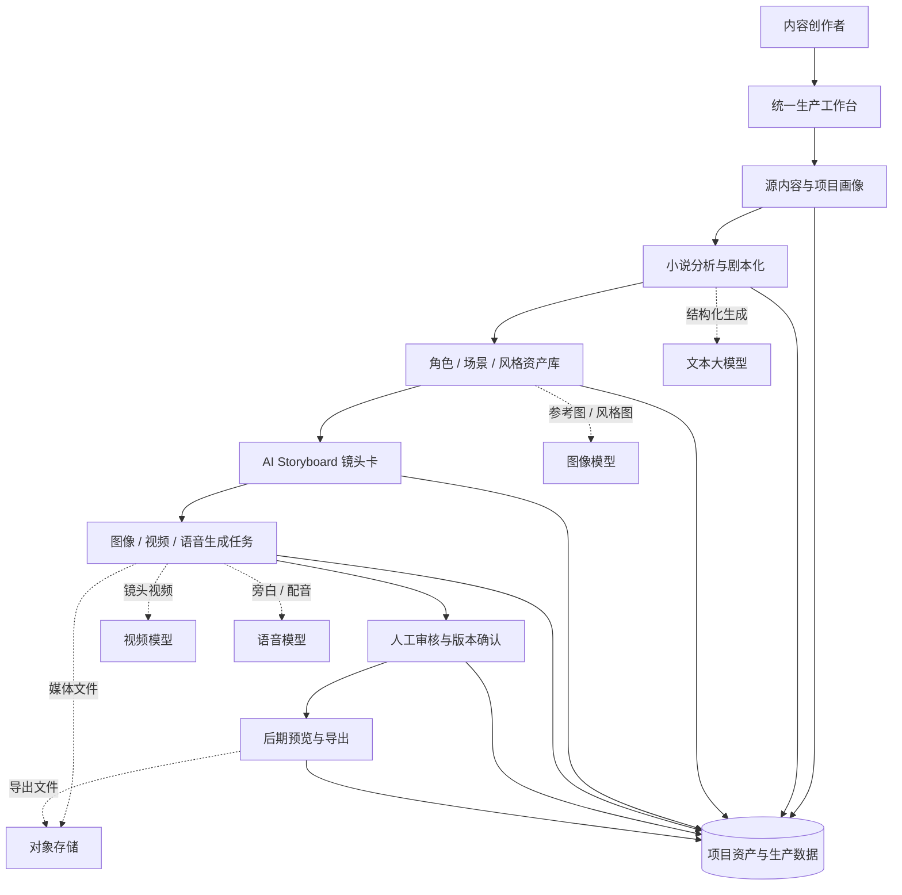

#### 2. 完整分层平台能力架构图

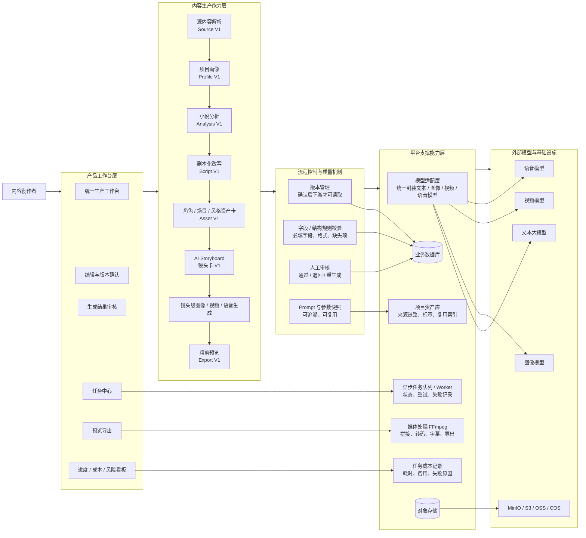

#### 3. 端到端生产流程图

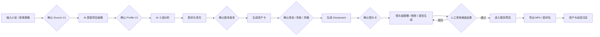

#### 4. 第一阶段系统结构图

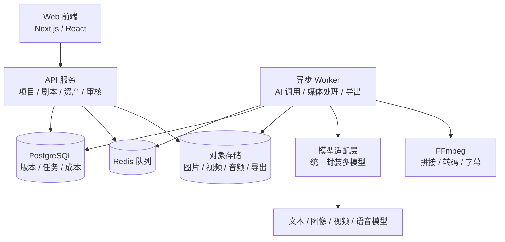

平台不按传统影视岗位拆分成编剧、美术、导演、制作、后期等多个登录角色。第一阶段默认由内容创作者在统一工作台中主导流程，AI 节点承担专业生产能力，人负责方向判断、修改确认和版本选择。

---

## 四、核心建设思路

平台采用“AI 生成 + 人工确认 + 版本保存 + 继续流转”的机制。

每一个关键节点都不是黑盒自动通过，而是先由 AI 生成候选结果，再由人确认后进入下一步。下游流程只读取已确认版本，避免未确认的 AI 结果污染后续生产。

核心机制包括：

1. 源内容确认：小说上传或粘贴后，先解析章节、正文、异常内容，确认 Source V1。
2. 项目画像确认：AI 从源内容和创作者意图中提取题材、目标格式、集数、时长、语言、视觉方向等，形成 Profile V1。
3. 小说分析确认：AI 提炼故事梗概、剧情结构、人物关系、场景列表、道具线索、情绪曲线。
4. 剧本版本确认：AI 改写分集、分场、台词、旁白、动作和场景说明，形成可编辑剧本。
5. 资产卡确认：AI 生成角色卡、场景卡、风格卡、道具卡、声音卡，为后续生成提供一致性约束。
6. Storyboard 确认：AI 按剧本拆解镜头，生成景别、机位、运镜、动作、情绪、台词、时长和镜头提示词。
7. 镜头生成与审核：每个镜头单独生成关键帧、参考图、视频片段和配音，保留多版本，人工选择正式版本。
8. 后期预览与导出：通过确认的镜头进入分集/场级/全片预览，生成粗剪视频或素材包。
9. 资产沉淀：保存文本、剧本、资产卡、Storyboard、提示词、模型参数、生成结果、审核意见、失败案例。

### 核心机制时序图

为了让管理层更直观看到平台如何把 AI 生成变成可控生产流程，下面 9 张时序图与前文 9 个核心机制一一对应。每个节点都遵循“读取已确认输入、AI 或系统生成候选、按业务规则检查字段和格式、人确认、保存版本快照、再向下游流转”的原则。

#### 1. 源内容确认

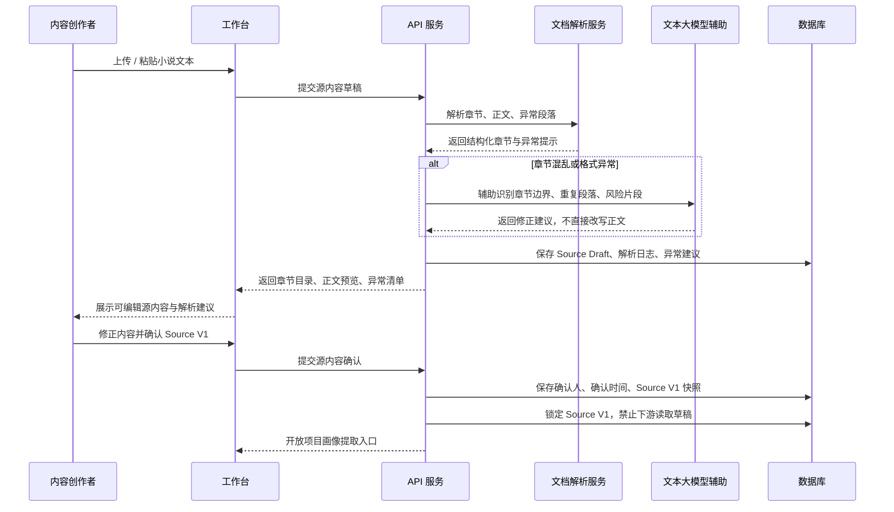

#### 2. 项目画像确认

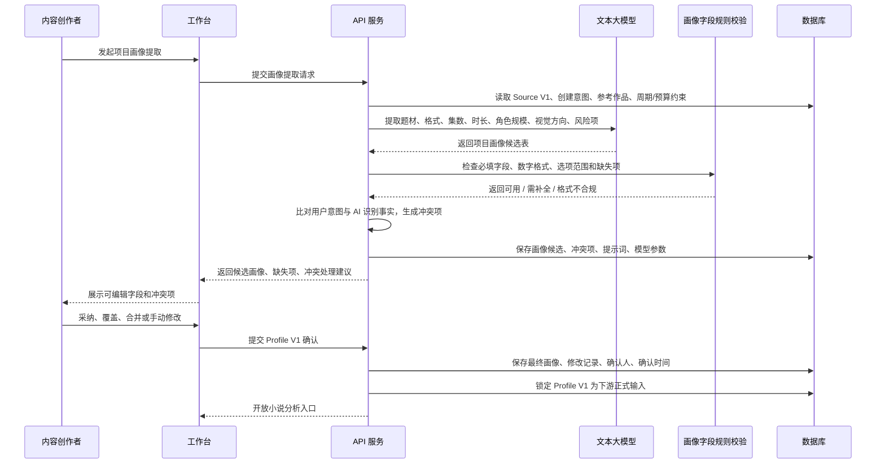

#### 3. 小说分析确认

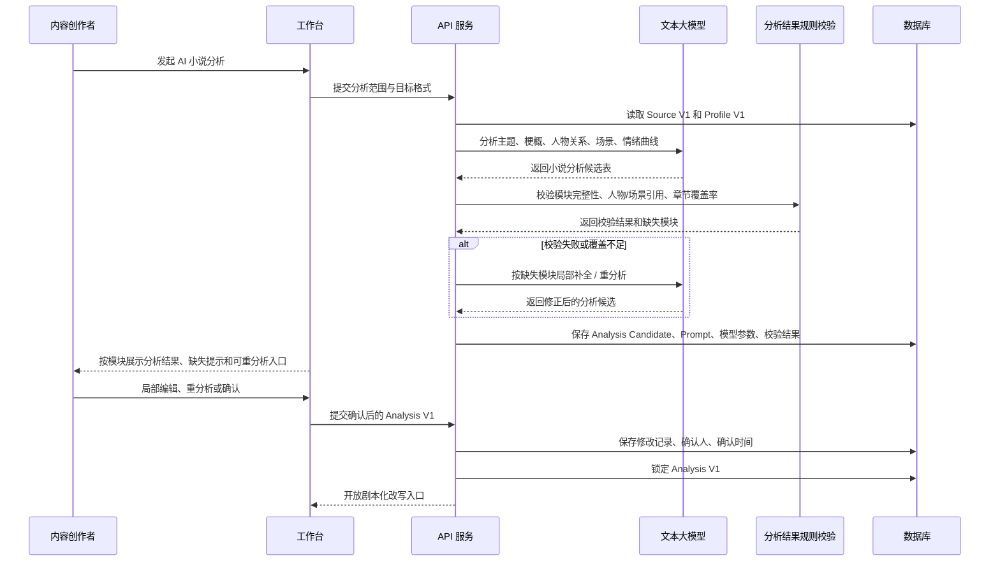

#### 4. 剧本版本确认

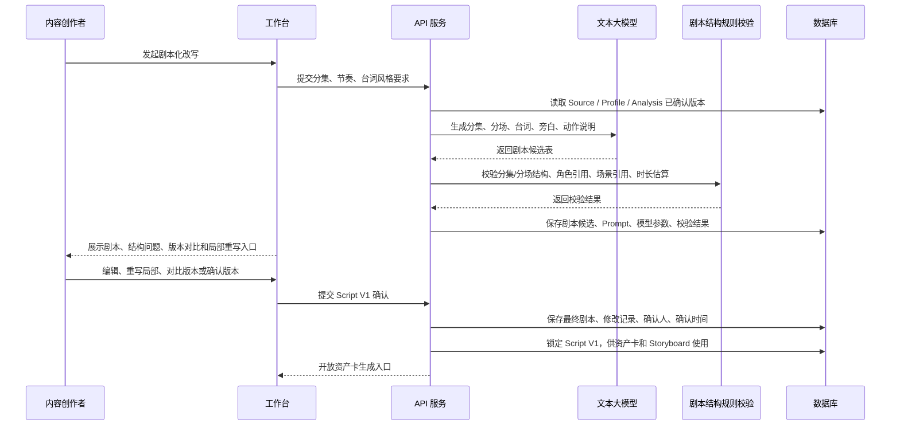

#### 5. 资产卡确认

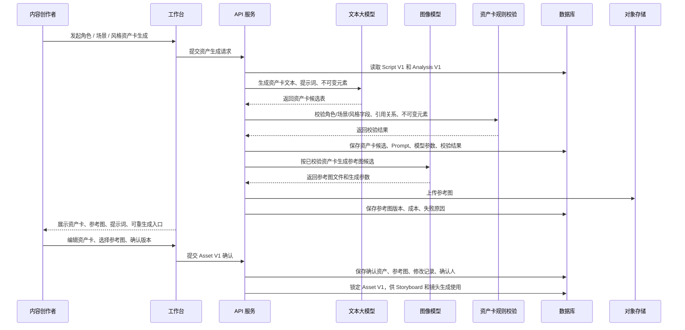

#### 6. Storyboard 确认

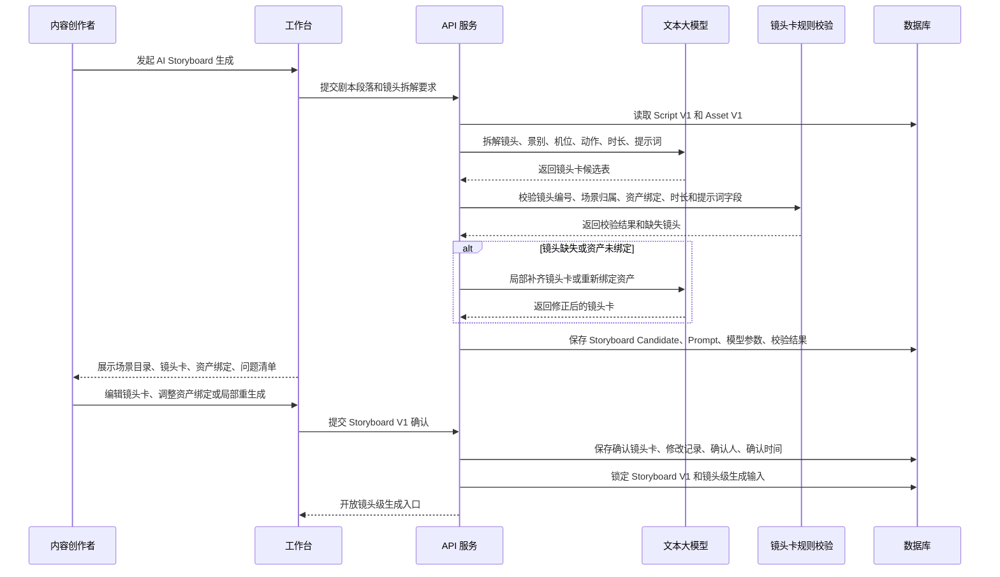

#### 7. 镜头生成与审核

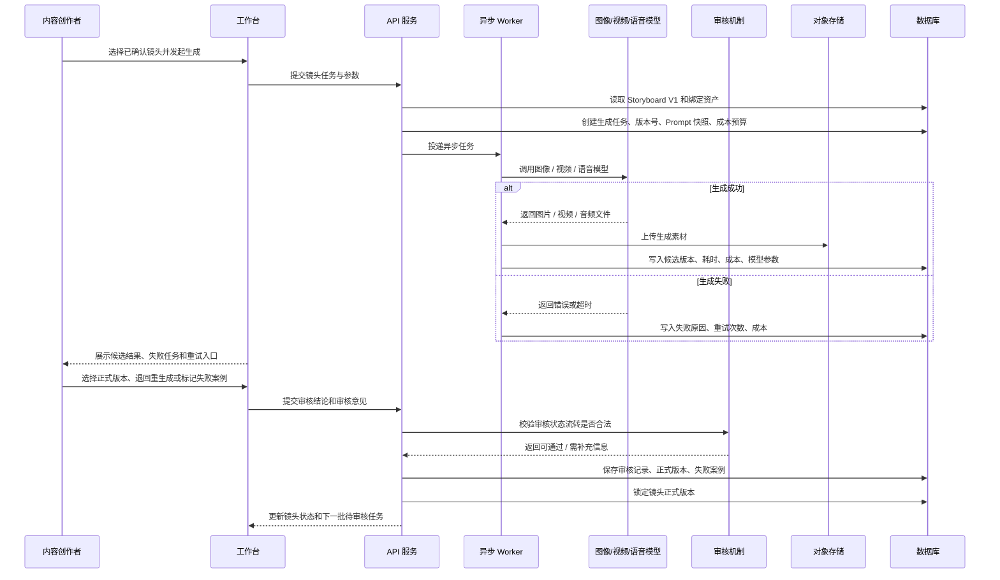

#### 8. 后期预览与导出

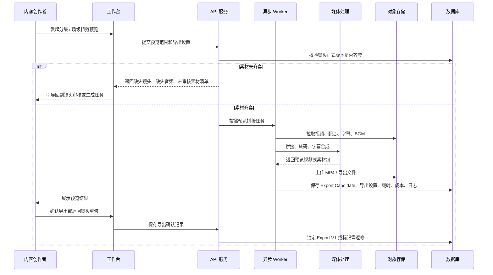

#### 9. 资产沉淀

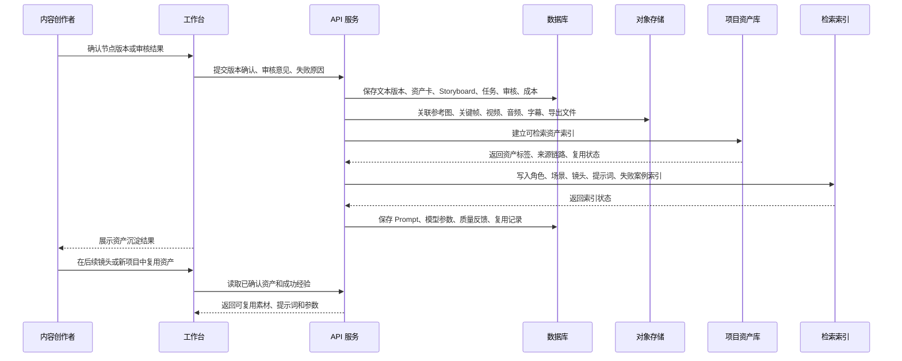

---

## 五、平台核心能力

### 1. 项目与生产工作台

用于创建项目、查看项目进度、当前阶段、待处理事项、失败任务和下一步动作。

第一阶段创建项目保持轻量，只先建立项目容器和创作者意图，不在创建时强制锁死题材、集数、时长和视觉风格。这些信息由 AI 在源内容解析后提取为项目画像，再由创作者确认。

### 2. 小说输入与源内容确认

支持粘贴小说正文、上传 TXT/DOCX/Markdown 文件、输入故事梗概。

系统会解析章节、识别异常、展示正文片段，创作者确认后形成 Source V1，作为后续 AI 分析的正式输入。

### 3. 项目画像提取

AI 从源内容中提取项目事实和生产设定，例如题材、类型、语言、目标格式、集数、单集时长、角色数量、视觉方向、内容风险和制作约束。

如果创作者初始意图和小说内容不一致，系统展示冲突项，由创作者决定采纳、覆盖或合并。

### 4. AI 小说分析

AI 生成故事主题、梗概、剧情结构、人物关系、场景列表、道具线索、情绪曲线等结构化分析结果。

创作者可按模块编辑、局部重分析、确认版本。

### 5. 剧本化改写

将小说内容改写为适合影视动漫或短剧生产的分集/分场剧本，包含场景说明、人物动作、台词、旁白、情绪和节奏。

剧本不是一次性定稿，而是支持编辑、重写、版本对比和确认。

### 6. 资产卡管理

生成并管理角色卡、场景卡、风格卡、道具卡和声音卡。

角色卡包含外形、服装、表情、动作习惯、声音风格、参考图和提示词。场景卡包含空间结构、光线、天气、关键道具、不可变元素和参考图。风格卡包含美术风格、色彩、光影、材质、镜头质感和负向提示词。

资产卡的作用是约束后续多镜头生成，提升角色、场景和风格一致性。

### 7. AI Storyboard

AI 根据确认剧本和资产卡拆解镜头，生成镜头编号、景别、机位、运镜、画面描述、人物动作、情绪、台词、旁白、时长、正向提示词和负向提示词。

Storyboard 是剧本到视频生成之间的关键中间层。

### 8. 镜头级生成任务

以镜头为单位发起图像、视频、语音和字幕任务。

每个任务记录输入资产、提示词、模型参数、生成状态、耗时、成本、错误原因和结果版本。失败任务可重试，成功结果可进入审核。

### 9. 生成结果审核

创作者可以对同一镜头的多个候选视频进行对比，选择一个作为正式版本，也可以退回、重生成、标记失败案例或调整参数。

只有通过审核的镜头才进入后期预览。

### 10. 后期预览与导出

第一阶段目标不是替代专业剪辑软件，而是实现自动粗剪和可交付预览。

系统按集、场、镜头顺序，把已确认视频片段自动组装为分集预览，可叠加字幕、配音、BGM 和音效，导出 MP4 或素材包。

后续可扩展全片母版、外部精剪清单、时间线调整和更复杂的音频混合。

### 11. 项目资产库

沉淀项目全过程资产，包括小说原文、剧本版本、角色卡、场景卡、风格卡、Storyboard、参考图、关键帧、视频片段、配音、字幕、提示词、模型参数、审核记录、失败案例和成本记录。

这些资产后续可用于复用、检索、模型效果对比和生产方法论沉淀。

### 12. 配套 UI 示意图

以下插图来自 `ai-content-platform-ui-board.html` 已渲染的高保真 UI 画板，用于帮助管理层快速理解产品最终会长什么样、用户在什么界面完成关键确认，以及资产沉淀如何支撑下一次生产。

#### 1. 项目生产工作台

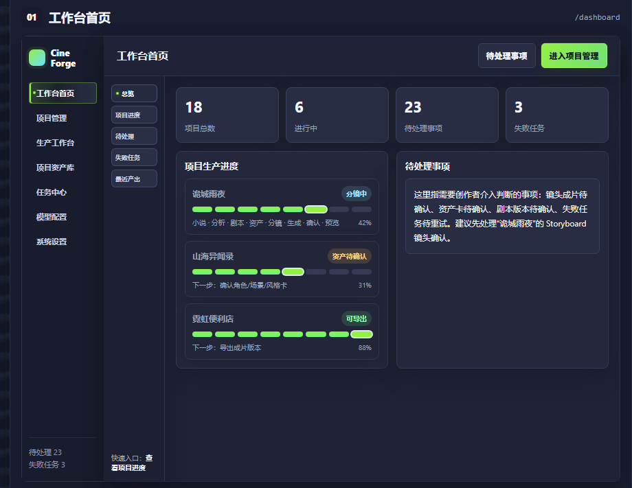

该界面聚合项目进度、待确认节点、任务成本、质量风险和下一步动作，让老板能直接看到平台不是“生成一个视频按钮”，而是可管理的生产工作台。

#### 2. Storyboard 与镜头审核

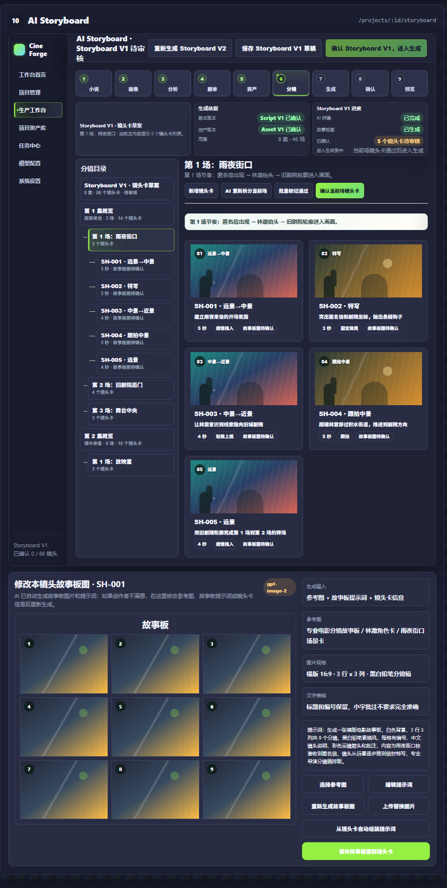

该界面强调镜头卡、资产绑定、提示词、候选结果和审核意见之间的关系，便于理解为什么平台能控制多镜头一致性。

#### 3. 镜头成片确认

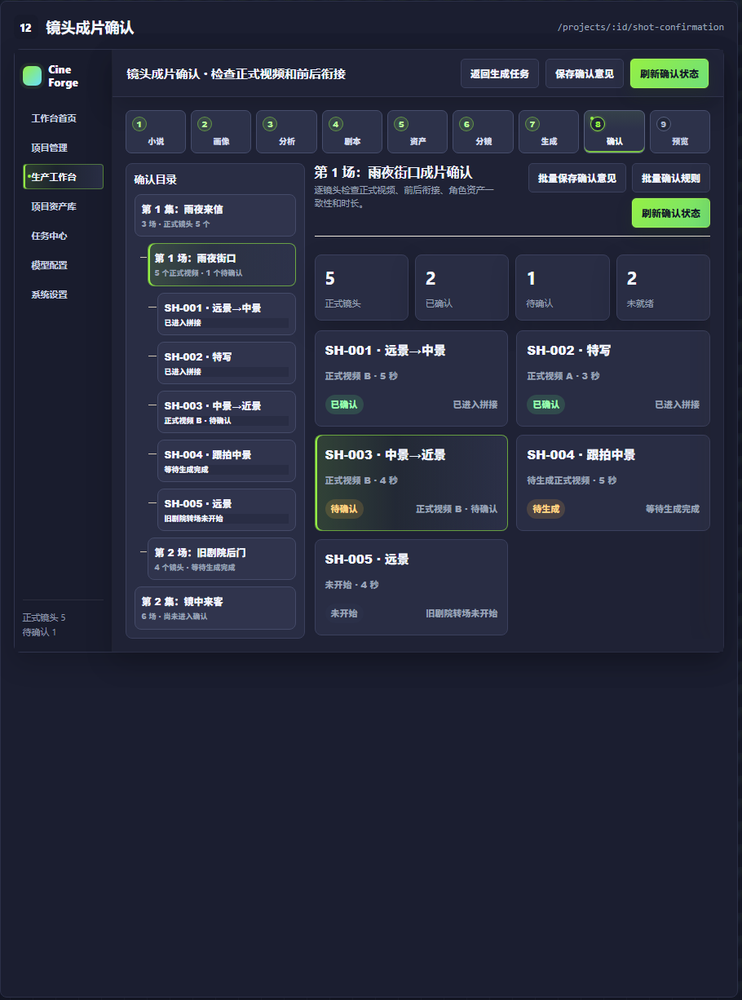

该界面展示同一镜头多个候选结果的对比、版本选择、退回重生成和审核确认，让管理层能理解人工把关如何嵌入 AI 生产链路。

#### 4. 项目资产库

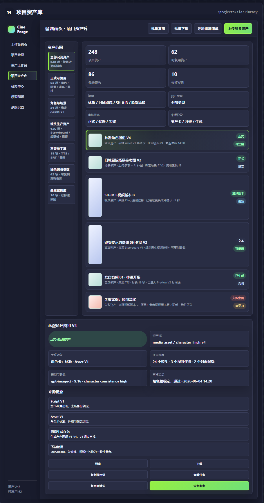

该界面展示角色卡、场景卡、风格卡、道具卡、提示词和失败案例如何沉淀为可复用资产，支撑后续批量化生产。

---

## 六、第一阶段建设范围

第一阶段不追求一次性做成完整大平台，而是优先完成一个可演示、可验证、可继续扩展的核心闭环。

建议第一阶段覆盖：

1. 项目创建与项目概览。
2. 小说输入、上传、解析和源内容确认。
3. 项目画像提取与确认。
4. AI 小说分析、编辑和确认。
5. 剧本化改写、编辑和确认。
6. 角色卡、场景卡、风格卡生成、编辑和确认。
7. AI Storyboard 生成、镜头卡编辑和确认。
8. 镜头级关键帧/参考图生成。
9. 至少一个视频模型的镜头级视频生成。
10. 生成结果审核、多版本选择和失败记录。
11. 分集粗剪预览与导出。
12. 项目资产库和基础任务记录。
13. 模型配置、提示词模板和成本记录的基础能力。

第一阶段暂不重点建设：

1. 复杂多人协同和传统岗位权限体系。
2. 商业级专业剪辑能力。
3. 全流程无人审核。
4. 复杂 Agent 自主规划。
5. 大规模资产市场。
6. 多租户私有化交付。
7. 高精度角色一致性检测算法。
8. 复杂财务结算。

---

## 七、阶段规划

### 阶段一：核心闭环原型

周期建议：8-12 周。

目标是跑通从小说输入到视频片段/粗剪预览的最小可用闭环，验证流程、模型效果、成本和人工审核机制。

阶段一交付物：

1. 可演示的产品原型和基础系统。
2. 小说输入、源内容确认、项目画像确认流程。
3. AI 小说分析和剧本化改写流程。
4. 角色/场景/风格资产卡样例。
5. Storyboard 镜头卡样例。
6. 镜头级图像和视频生成任务。
7. 人工审核和正式版本确认。
8. 分集粗剪预览或素材包导出。
9. 项目资产库和任务记录。
10. 试点项目演示样片。

### 阶段二：生产管理增强

目标是提升可用性和生产效率。

可增加批量镜头生成、多模型结果对比、成本统计、任务中心、失败原因分析、角色一致性辅助检查、提示词模板管理、资产复用推荐和项目级审核流程。

### 阶段三：平台化能力

目标是从项目工具升级为公司级内容生产平台。

可支持多项目管理、工作流模板、轻量协作、资产库检索、跨项目资产复用、API 开放、私有化部署、数据看板和生产流程配置。

---

## 八、推荐排期

建议采用 10 周标准版本：

| 周期 | 重点 | 核心交付 |
|---|---|---|
| 第 1 周 | 项目启动与工程基础 | 范围确认、技术框架、数据库/API 骨架、UI 原型确认 |
| 第 2 周 | 项目与源内容 | 项目管理、小说输入、文件上传、章节解析、Source V1 确认 |
| 第 3 周 | 项目画像与小说分析 | Profile V1 提取确认、AI 小说分析、结构化输出校验 |
| 第 4 周 | 剧本化改写 | 分集/分场剧本生成、剧本编辑、版本确认 |
| 第 5 周 | 资产卡生成 | 角色卡、场景卡、风格卡生成与编辑 |
| 第 6 周 | Storyboard | 镜头卡生成、资产绑定、提示词生成、镜头确认 |
| 第 7 周 | 图像生成 | 角色/场景参考图、关键帧/首帧生成、多版本审核 |
| 第 8 周 | 视频生成 | 镜头级视频任务、状态轮询、结果入库、审核确认 |
| 第 9 周 | 后期预览与资产库 | 分集粗剪、字幕/配音基础、导出版本、资产沉淀 |
| 第 10 周 | 联调验收与汇报 | 演示项目、问题修复、成本统计、验收报告 |

如果周期压缩到 8 周，需要弱化提示词模板后台、完整任务中心、声音卡、道具卡和复杂预览编辑。

如果周期放宽到 12 周，可更稳妥地增加任务中心、成本看板、更多模型适配和演示样片质量打磨。

---

## 九、资源需求

### 1. 模型能力需求

第一阶段至少需要：

1. 文本大模型：用于小说理解、项目画像、剧本改写、资产卡生成、Storyboard 和提示词生成。
2. 图像生成模型：用于角色参考图、场景参考图、风格参考图、关键帧和首帧生成。
3. 视频生成模型：用于文生视频、图生视频、首帧视频或首尾帧视频。
4. 语音模型：用于角色配音、旁白和声音样例。
5. 基础后期工具：FFmpeg 用于拼接、转码、字幕合成和导出。

### 2. 基础设施建议

采用稳定、可扩展的技术方案：

1. 前端：Next.js / React。
2. 后端：FastAPI 或同类 Web API 框架。
3. 数据库：PostgreSQL。
4. 对象存储：MinIO / S3 / OSS / COS。
5. 队列：Redis + Celery 或同类异步任务方案。
6. 媒体处理：FFmpeg。
7. 部署：Docker / Docker Compose。

---

## 十、投入产出预期

### 1. 短期产出

第一阶段完成后，预期可以获得：

1. 一套可演示的 AI 内容生产工作台。
2. 一个从小说到视频片段/粗剪预览的完整样例。
3. 一套结构化生产流程：源内容、项目画像、小说分析、剧本、资产卡、Storyboard、镜头生成、审核、预览。
4. 一批可复用资产：角色卡、场景卡、风格卡、提示词模板、模型参数、参考图、生成结果。
5. 一套可评估的数据：任务耗时、模型调用成本、失败原因、人工修改点、生成质量反馈。
6. 后续是否扩大投入的决策依据。

### 2. 长期价值

长期来看，平台可以带来：

1. 缩短前期内容拆解和剧本开发时间。
2. 降低编剧、美术、分镜、制作、后期之间的反复沟通成本。
3. 提升角色、场景、风格和镜头提示词的一致性。
4. 降低 AI 视频生成的盲目试错成本。
5. 沉淀公司自己的提示词、资产卡、分镜规则和生产经验。
6. 形成批量化短剧、漫剧、动画样片和 IP 视频化的生产基础。
7. 为未来多项目、多模型、多团队协作和平台化管理打基础。

---

## 十一、主要风险与应对

| 风险 | 影响 | 应对策略 |
|---|---|---|
| 范围过大 | 周期拉长、难以交付 | 第一阶段只做核心闭环，不做大而全平台 |
| 模型输出不稳定 | 影响剧本、分镜和资产质量 | 使用结构化输出、字段规则校验、人工确认和重试 |
| 视频生成质量不稳定 | 成片效果不可控 | 镜头级生成、多版本候选、人工审核、失败案例记录 |
| 角色一致性不足 | 多镜头人物漂移 | 通过角色卡、参考图、提示词模板和人工筛选约束 |
| 场景和画风漂移 | 视觉统一性差 | 建立场景卡、风格卡、不可变元素和负向提示词 |
| 成本不可控 | 模型调用费用上升 | 记录任务级成本，优先少量镜头验证，再批量生成 |
| 技术路线复杂 | 研发投入变大 | 第一阶段采用轻量技术栈，先验证流程，再平台化 |
| AI 结果不可直接使用 | 影响交付质量 | 保留人工审核、版本管理、局部重生成和可编辑机制 |

---

## 十二、管理层需要决策的事项

建议管理层重点决策以下事项：

1. 是否批准第一阶段核心闭环原型建设。
2. 第一阶段周期按 8 周、10 周还是 12 周推进。
3. 第一阶段预算和团队投入规模。
4. 选定 1-2 个适合 AI 视频化的小说、短剧或漫剧样例作为试点。
5. 确认可用的文本、图像、视频和语音模型供应商。
6. 明确第一阶段验收标准：不是做完整商业平台，而是验证核心生产闭环和样片能力。

---

## 十三、建议结论

建议启动 AI 内容工业化平台第一阶段建设。

第一阶段应以“可用模型 + 试点内容 + 结构化流程 + 人工确认 + 镜头级生成 + 粗剪预览”为核心，不追求一次性覆盖所有功能。

该项目的价值不只是做一个 AI 视频工具，而是帮助公司建立自己的 AI 内容生产方法论：把小说、剧本、角色、场景、风格、分镜、提示词、模型参数和生成结果统一管理起来，让 AI 能在可控流程中持续提高效率，并让项目经验沉淀为可复用资产。

建议先用 8-12 周完成一个可演示、可评估、可继续扩展的核心闭环原型，再根据模型效果、内容质量、成本表现和团队使用反馈，决定是否进入第二阶段生产管理能力建设。
